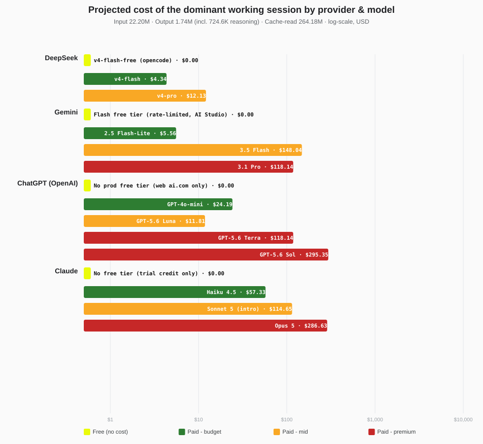

# Cable&Net Courses — LMS

A live, database-driven learning management system for cable & networking training.
Course content, modules, students, instructors, and progress are all managed through
Supabase — no hardcoding.

**Live site:** https://rajbabna.github.io/LMS-CableNet

---

## AI token usage & cost report

This project is developed with an AI coding assistant (opencode). The report below
shows the workload's token usage and what it **would have cost** if the same sessions
had been billed on paid subscription tiers of DeepSeek, Gemini, ChatGPT and Claude —
converted to Mauritian Rupees (1 USD = 47.04 MUR).



<!-- COST-TABLE-START -->
| Provider | Type | Model | Cost (USD) | Cost (MUR) |
|---|---|---|---|---:|
| DeepSeek | Free | v4-flash-free (opencode) | $0.00 | Rs 0.00 |
| DeepSeek | Paid | v4-flash | $8.40 | Rs 394.93 |
| DeepSeek | Paid | v4-pro | $23.28 | Rs 1,095.07 |
| Gemini | Free | Flash free tier (rate-limited, AI Studio) | $0.00 | Rs 0.00 |
| Gemini | Paid | 2.5 Flash-Lite | $11.11 | Rs 522.58 |
| Gemini | Paid | 3.5 Flash | $301.40 | Rs 14,177.88 |
| Gemini | Paid | 3.1 Pro | $235.94 | Rs 11,098.78 |
| ChatGPT (OpenAI) | Free | No prod free tier (web ai.com only) | $0.00 | Rs 0.00 |
| ChatGPT (OpenAI) | Paid | GPT-4o-mini | $49.85 | Rs 2,344.89 |
| ChatGPT (OpenAI) | Paid | GPT-5.6 Luna | $23.59 | Rs 1,109.88 |
| ChatGPT (OpenAI) | Paid | GPT-5.6 Terra | $235.94 | Rs 11,098.78 |
| ChatGPT (OpenAI) | Paid | GPT-5.6 Sol | $589.86 | Rs 27,746.96 |
| Claude | Free | No free tier (trial credit only) | $0.00 | Rs 0.00 |
| Claude | Paid | Haiku 4.5 | $114.53 | Rs 5,387.61 |
| Claude | Paid | Sonnet 5 (intro) | $229.07 | Rs 10,775.23 |
| Claude | Paid | Opus 5 | $572.66 | Rs 26,938.07 |
<!-- COST-TABLE-END -->

> Full interactive report with per-session breakdown, timestamps and live-updating
> numbers: [token-cost-report.html](https://rajbabna.github.io/LMS-CableNet/token-cost-report.html)

---

## Features

- **Dynamic landing page** — course cards load from Supabase with login-aware status
  (Access by invitation / Awaiting approval / Preview available / Enrolled / Access expired /
  Staff access) and a single "Log in to access" CTA.
- **Auth (email/password)** — sign-in only; the **admin creates all accounts** from the
  dashboard (no self-signup, no `pending.html`).
- **Roles** — admin, instructor, student. Instructors see only their assigned courses;
  admins get the full account/enrollment/assignment UI.
- **Preview mode** — students can view any course (module titles/descriptions) but
  resources and "Mark Complete" stay locked unless they're enrolled.
- **Time-limited enrollment** — the admin picks an access window per student
  (24h / 7 / 30 / 90 / 180 days / lifetime). When `enrollments.expires_at` passes, the
  student is downgraded to preview/expired automatically across the site.
- **Progress tracking** — `module_completions` + `course_progress_view` drive student
  progress bars.
- **Course assignment** — admin assigns instructors to courses via `assign_instructor`;
  dropdowns/filters populate from `get_my_courses()`.
- **Mentor sessions** — (retired from UI, schema kept for optional future use) the
  `mentor_sessions` table + RPCs still exist but there is no logging form or timeline
  shown anymore; the instructor dashboard button now opens the student's **AI Chats** view.
- **AI Mentor (Ask the Mentor)** — a floating chat widget on the course pages powered by
  Puter's keyless AI layer (`js/ai-mentor.js`). Course-aware study buddy that explains and
  guides; clearly labeled as an AI assistant; requires connectivity and a free Puter sign-in.
  Chat **topic summaries are always captured** (`mentor_ai_sessions`, never raw messages;
  disclosed in the widget) so instructors can improve the course; instructors see them on
  the student profile and an aggregate activity panel on the instructor dashboard.
- **Study packs** — downloadable, single-file offline packs per lesson module
  (`tools/study-packs/`) containing notes, an embedded quiz, and progress tracking that
  works with no internet. When back online, students can sign in and sync their best
  score to the course. Generated from the same quiz banks the online quiz uses.
- **Remove from course** — staff can remove a student from a course (enrollment +
  all course progress/quiz/certificate/AI-mentor data for that course), with a
  confirm-gated modal. Requires `sql/61` applied.

## Tech

- Static HTML/CSS/JS served on **GitHub Pages**
- **Supabase** (PostgreSQL + Auth) via the UMD `supabase-js` client (`js/config.js`)
- RPCs in `sql/` (run `01` → `62` in the Supabase SQL Editor in order — see `docs/CURRENT-STATUS.md`)

## Project layout

```
index.html                  dynamic landing page
login.html                  sign-in only
student-dashboard.html      student dashboard (all courses + progress)
instructor-dashboard.html   instructor/admin dashboard
student-profile.html        instructor mentor log for one student (timeline + form)
course-cabling.html         course page (preview-locked)
course-networking.html      course page (preview-locked)
js/                         config, client, loaders, auth-guard, progress, mentor-sessions, study-pack entry points
tools/                      standalone tools + generated study packs (tools/study-packs/)
css/                        design system + progress styles
sql/                        schema, RPCs, triggers, cleanup scripts (01–60, gitignored)
docs/                       documentation + future interactive-content plan
```

## Accounts (dev)

Test-account emails and passwords are kept out of this public repo — see the internal
beta-test kit on the owner's machine for credentials.

## Deploy

The site auto-deploys on push to `main` (GitHub Pages, ~1–3 min rebuild).
Three local copies must stay in sync — `LMS - V2.0` is the git source of truth;
mirrors live in `Sites\WEB` and `Sites\GitHub Web\cable-net-courses`.

See `docs/SESSION-HANDOFF.md` and `docs/CURRENT-STATUS.md` for the current project
state and parked future work (Puter course-app, certificates, admin module
manager).
