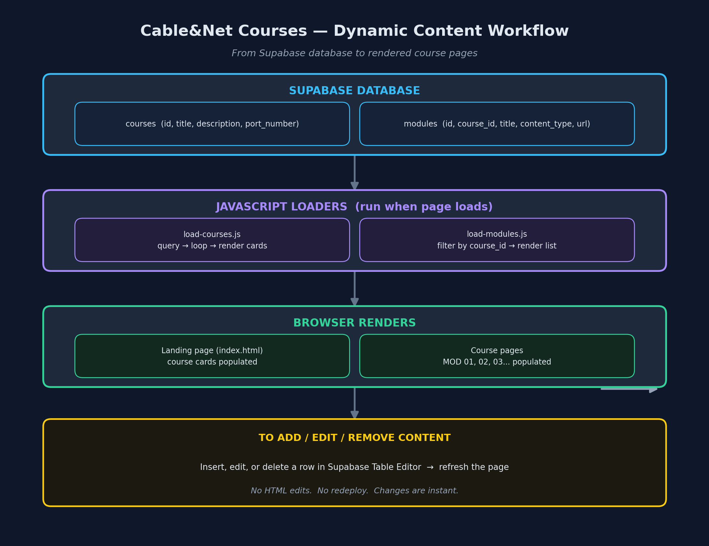

# 🚀 Cable&Net Courses - Dynamic System READY TO DEPLOY

> 🔖 Picking this back up after a break? Check [RESUME.md](./RESUME.md) first for exactly where things stopped.

> 📁 All documentation lives in `/docs`. Site files (`index.html`, `course-*.html`, `js/`, SQL) live in the project root — one level up from this folder.

## ✅ What's Done

The platform is **live and fully functional** — dynamic content, working auth, preview mode, progress tracking, and instructor/admin dashboards.

- ✅ Courses + modules loaded from Supabase (not hardcoded)
- ✅ Supabase project connected — `js/supabase-client.js` has real project URL + publishable key wired in
- ✅ Role-based auth (admin / instructor / student) — email/password, confirmation OFF
- ✅ Preview mode — students see all courses; resources + completion locked unless enrolled
- ✅ Instructor/admin dashboard — enrollment, course assignment, account creation
- ✅ Progress tracking — `module_completions` + `course_progress_view`
- ✅ Self-signup removed — admin is the only account creator (no `pending.html`)
- ✅ Time-limited enrollment — admin/instructor sets an access window (24h–180d/lifetime); expired students downgrade to preview automatically



---

## 📌 Current Project Status

- ✅ Live on GitHub Pages: https://rajbabna.github.io/LMS-CableNet (repo `rajbabna/LMS-CableNet`)
- ✅ **Three local copies** must stay in sync: `LMS - V2.0` (git source of truth), `Sites\WEB`, `Sites\GitHub Web\cable-net-courses`
- ✅ Schema + RPCs built out through `sql/26` (see `sql/` folder; `01`–`26`)
- ✅ Accounts: admin `REDACTED`, instructor `REDACTED`, students `REDACTED` + `REDACTED`
- ⏳ **Course content** is a separate project — module materials (PDF/video/interactive) come later; plan in `docs/content/`
- ⏳ Certificates, admin module manager, stalled-student reports — not yet built

---

## 📖 Where to Start

### 1️⃣ **If You Just Want to Get It Running Fast**

Read: **[README-DYNAMIC-SETUP.md](./README-DYNAMIC-SETUP.md)** (4 minutes)

Then follow these steps:
1. Run SQL from `01-supabase-schema.sql` in Supabase
2. Add/replace `index.html` with the dynamic version
3. Add `js/load-courses.js` and `js/load-modules.js` to your site
4. Update `course-cabling.html` and `course-networking.html`
5. Test and you're live!

---

### 2️⃣ **If You Want to Understand the System First**

Read in this order:

1. **[SYSTEM-SUMMARY.md](./SYSTEM-SUMMARY.md)** (5 min) — Overview of what you built
2. **[ARCHITECTURE.md](./ARCHITECTURE.md)** (5 min) — How the system works (diagrams included)
3. **[IMPLEMENTATION-GUIDE.md](./IMPLEMENTATION-GUIDE.md)** (5 min) — Setup instructions for courses
4. **[MODULES-IMPLEMENTATION-GUIDE.md](./MODULES-IMPLEMENTATION-GUIDE.md)** (10 min) — Setup instructions for modules
5. **[MODULES-QUICK-REFERENCE.md](./MODULES-QUICK-REFERENCE.md)** (2 min) — Quick tasks reference

---

### 3️⃣ **If You Just Need a Quick Reference**

**[MODULES-QUICK-REFERENCE.md](./MODULES-QUICK-REFERENCE.md)** — One-page cheat sheet for common tasks

---

## 📦 Files You're Getting

### HTML Files (Updated)
```
index.html                   ← Dynamic landing page (login-aware status + single CTA)
course-cabling.html          ← Course page with preview-mode locking
course-networking.html       ← Course page with preview-mode locking
login.html                   ← Sign-in only (no self-signup)
student-dashboard.html       ← Student dashboard (all courses + progress)
instructor-dashboard.html    ← Instructor/admin dashboard
```

### JavaScript Files (New)
```
js/load-courses.js           ← NEW - loads courses on landing page
js/load-modules.js           ← NEW - loads modules on course pages
js/auth-guard.js             ← Session + course enrollment guard
js/progress/student-dashboard.js ← Student dashboard logic
js/supabase-client.js        ← ✅ Configured with live project URL + key
```

### Database Schema (SQL)
```
sql/01-supabase-schema.sql .. sql/26-time-limited-enrollment-and-guests.sql
                              ← Run in order in Supabase SQL Editor
```

### Documentation — all in `/docs`
```
docs/START-HERE.md                       ← You are here!
docs/SYSTEM-SUMMARY.md                   ← Complete overview
docs/README-DYNAMIC-SETUP.md             ← 4-min quick start
docs/MODULES-IMPLEMENTATION-GUIDE.md     ← Detailed modules setup
docs/MODULES-QUICK-REFERENCE.md          ← One-page cheat sheet
docs/workflow-diagram.png                ← Visual overview of the data flow
docs/ARCHITECTURE.md                     ← System design & data flows
docs/IMPLEMENTATION-GUIDE.md             ← Detailed courses setup
```

---

## 🎯 Next Steps (In Order)

### Step 1: Understand What You Have (5 minutes)

Read **SYSTEM-SUMMARY.md**

You'll learn:
- What changed (before vs after)
- How the system works
- What files you need
- How to add/edit/delete content

### Step 2: Set Up the Database (5 minutes)

Run the SQL schema in Supabase:

1. Open your Supabase project
2. Go to **SQL Editor** → **New Query**
3. Copy-paste entire `01-supabase-schema.sql`
4. Click **Run**
5. Verify: Go to **Table Editor** → you should see:
   - ✓ `courses` table (2 rows: cabling, networking)
   - ✓ `modules` table (8 rows: sample modules)

### Step 3: Update Your Site Files (10 minutes)

Replace these files on your server:

1. **Replace `index.html`**
   - Upload the dynamic version directly as `index.html` to your site root

2. **Build course pages**
   - Create `course-cabling.html` (no prior version exists)
   - Create `course-networking.html` (no prior version exists)

3. **Add new JavaScript files**
   - Upload `js/load-courses.js` (new)
   - Upload `js/load-modules.js` (new)

Your folder structure should look like:
```
/
├── index.html (dynamic landing)
├── login.html (sign-in only)
├── student-dashboard.html
├── instructor-dashboard.html
├── course-cabling.html
├── course-networking.html
├── css/
│   ├── style.css
│   └── progress-tracking-styles.css
├── js/
│   ├── config.js
│   ├── supabase-client.js
│   ├── auth-guard.js
│   ├── load-courses.js
│   ├── load-modules.js
│   └── progress/
│       └── student-dashboard.js
└── sql/
    ├── 01-supabase-schema.sql
    └── ... (through 26-time-limited-enrollment-and-guests.sql)
```

### Step 4: Test It Works (5 minutes)

1. Open **index.html** in your browser
   - Should see two course cards from Supabase ✓

2. Log in and visit **course-cabling.html**
   - Should see 4 modules from Supabase ✓

3. Visit **course-networking.html**
   - Should see 4 modules from Supabase ✓

### Step 5: Update Your Content (15 minutes)

Replace the example URLs with your real content:

1. Prepare your lessons:
   - PDFs (upload to server/GitHub/Google Drive)
   - Videos (YouTube/Vimeo links)
   - Interactive tools (host on your server)

2. Update Supabase:
   - Go to **Table Editor** → **modules**
   - Click each `content_url` cell
   - Replace example URL with your real URL
   - Save (auto)

3. Refresh course pages → links point to your content ✓

### Step 6: You're Live! 🚀

Done! Your site is now:
- ✅ Fully dynamic (no hardcoding)
- ✅ Content managed in Supabase
- ✅ Ready to scale

---

## 📚 Documentation Map

| Need | Document | Read Time | Status |
|------|----------|-----------|--------|
| Quick start | [README-DYNAMIC-SETUP.md](./README-DYNAMIC-SETUP.md) | 4 min | ✅ |
| Full overview | [SYSTEM-SUMMARY.md](./SYSTEM-SUMMARY.md) | 10 min | ✅ |
| Visual overview | [workflow-diagram.png](./workflow-diagram.png) | 1 min | ✅ |
| How it works | [ARCHITECTURE.md](./ARCHITECTURE.md) | 5 min | ✅ |
| Courses setup | [IMPLEMENTATION-GUIDE.md](./IMPLEMENTATION-GUIDE.md) | 5 min | ✅ |
| Modules setup | [MODULES-IMPLEMENTATION-GUIDE.md](./MODULES-IMPLEMENTATION-GUIDE.md) | 10 min | ✅ |
| Quick reference | [MODULES-QUICK-REFERENCE.md](./MODULES-QUICK-REFERENCE.md) | 2 min | ✅ |

---

## ❓ Common Questions

### Q: How long does this take to set up?
**A:** ~30 minutes total:
- 5 min: Read overview
- 5 min: Run SQL in Supabase
- 10 min: Upload files to server
- 5 min: Test
- 5 min: Update content URLs

### Q: Do I need to change any code?
**A:** No. Just:
1. Run the SQL
2. Upload the files
3. Update the content URLs in Supabase

No code editing required.

### Q: What if I make a mistake?
**A:** Everything is reversible:
- Edited the wrong thing? Just edit it back
- Added wrong module? Delete it
- Wrong URL? Update it
- Everything is live-editable

### Q: Can I add more courses?
**A:** Yes! Just add a row to the `courses` table. It'll appear on landing page instantly.

### Q: Can I have 10+ modules per course?
**A:** Yes! Add as many as you want. They'll all load and display automatically.

### Q: Are my students' data safe?
**A:** Yes:
- Login/password → Supabase Auth (encrypted)
- Course access → gated by approval flag
- Student progress → tracked via `module_completions` + `course_progress_view`

### Q: What if my site goes down?
**A:** Supabase is cloud-hosted and highly available. But you could also:
- Host the HTML files on GitHub Pages
- Serve from multiple servers
- Add a CDN for performance

---

## 🎓 Learning Paths

### Path 1: "Just Get It Running"
→ [README-DYNAMIC-SETUP.md](./README-DYNAMIC-SETUP.md) → Deploy → Done

### Path 2: "I Want to Understand It"
→ [SYSTEM-SUMMARY.md](./SYSTEM-SUMMARY.md) → [ARCHITECTURE.md](./ARCHITECTURE.md) → Deploy → [MODULES-QUICK-REFERENCE.md](./MODULES-QUICK-REFERENCE.md)

### Path 3: "I'm a Details Person"
→ [SYSTEM-SUMMARY.md](./SYSTEM-SUMMARY.md) → [ARCHITECTURE.md](./ARCHITECTURE.md) → [IMPLEMENTATION-GUIDE.md](./IMPLEMENTATION-GUIDE.md) → [MODULES-IMPLEMENTATION-GUIDE.md](./MODULES-IMPLEMENTATION-GUIDE.md) → Deploy → [MODULES-QUICK-REFERENCE.md](./MODULES-QUICK-REFERENCE.md)

### Path 4: "Just Give Me the Checklist"
→ [MODULES-QUICK-REFERENCE.md](./MODULES-QUICK-REFERENCE.md) (skip reading, just do)

---

## 🚀 Deployment Checklist

- [ ] Read SYSTEM-SUMMARY.md (understand what you have)
- [ ] Run SQL schema in Supabase (creates tables)
- [ ] Verify tables exist in Supabase
- [ ] Upload updated HTML files
- [ ] Upload new JavaScript files
- [ ] Test landing page (courses load?)
- [ ] Test cabling course (modules load?)
- [ ] Test networking course (modules load?)
- [ ] Update content URLs in Supabase
- [ ] Test links work (click one, opens content)
- [ ] Live! 🎉

---

## 📞 If You Get Stuck

**Problem:** Courses don't appear on landing page
- Check: Does `courses` table have data?
- Check: Is `load-courses.js` loading?
- Check: Browser console (F12) for errors

**Problem:** Modules don't appear on course page
- Check: Does `modules` table have data for this course_id?
- Check: Is `load-modules.js` loading?
- Check: Browser console (F12) for errors

**Problem:** Links are broken
- Check: Are the URLs in `content_url` column valid?
- Check: Can you access them directly?

**Problem:** Something else?
- Check the relevant `.md` file's **Troubleshooting** section
- Read the browser console (F12 → Console tab)
- Email me with the error message 😊

---

## ✨ What You Can Do Now

**Without touching code:**
✅ Add a new course (insert row)
✅ Add a new module (insert row)
✅ Edit course titles (click cell)
✅ Edit module descriptions (click cell)
✅ Change lesson URLs (click cell)
✅ Reorder modules (change module_number)
✅ Delete modules (right-click → delete)
✅ Publish changes instantly (no deployment)

**With minimal code (if you want):**
⚡ Track student progress (new table)
⚡ Add course prerequisites (new column)
⚡ Show estimated duration (new column)
⚡ Add difficulty levels (new column)

---

## 🎯 Bottom Line

**Old way:** Edit HTML → git push → wait for deploy → hope it works

**New way:** Edit Supabase cell → press Enter → see changes instantly

You've gone from a static site to a dynamic CMS. 🚀

---

## 📖 Read This Next

**→ [SYSTEM-SUMMARY.md](./SYSTEM-SUMMARY.md)** (5 minutes, then you'll understand everything)

Good luck! 🎓
